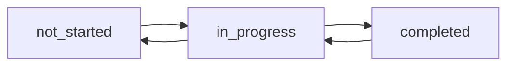

# Project Management API Documentation

## Table of Contents
- [Authentication](#authentication)
- [Users Management](#users-management)
- [Projects](#projects)
- [Tasks](#tasks)
- [Dashboard](#dashboard)
- [Search](#search)
- [Supplemental Information](#supplemental-information)

--- 

## 🔐 Authentication

### Register User  
**POST** `/api/auth/register`  
**Request Body**:
```json
{
    "name": "John Doe",
    "email": "john@example.com",
    "password": "password123", 
    "role": "user"
}
```

**Response** (201 Created):
```json
{
    "id": "user_123",
    "name": "John Doe",
    "email": "john@example.com",
    "role": "user",
    "authToken": "eyJhbGciOiJIUzI1NiIsInR5cCI6IkpXVCJ9..."
}
```

### Login User  
**POST** `/api/auth/login`  
**Request Body**:
```json
{
    "email": "john@example.com",
    "password": "password123"
}
```

**Response** (200 OK):
```json
{
    "userId": "user_123",
    "token": "eyJhbGciOiJIUzI1NiIsInR5cCI6IkpXVCJ9...",
    "expiresIn": 3600
}
```

### Logout User  
**POST** `/api/auth/logout`  
**Headers**:
- `Authorization: Bearer {{user_token}}`

**Response** (204 No Content)

---

## 👥 Users Management

### Create User (Admin)  
**POST** `/api/users`  
**Headers**:
- `Authorization: Bearer {{admin_token}}`

**Request Body**:
```json
{
    "name": "New User",
    "email": "newuser@example.com",
    "password": "password123",
    "role": "user"
}
```

**Test Cases**:  
| Scenario | Expected Status | Assertions |
|----------|-----------------|------------|
| Valid admin token | 201 Created | - Returns user ID<br>- Includes auth token |
| Missing required fields | 400 Bad Request | - Error details in response |
| Duplicate email | 409 Conflict | - Clear conflict message |

---

## 📁 Projects

### Create Project (Manager/Admin)  
**POST** `/api/projects`  
**Headers**:
- `Authorization: Bearer {{manager_token}}`

**Request Body**:
```json
{
    "name": "New Project",
    "description": "Project description",
    "managerId": "{{manager_id}}",
    "start_date": "2025-01-01T00:00:00.000Z",
    "end_date": "2025-12-31T00:00:00.000Z"
}
```

**Parameters**:  
| Name | Type | Required | Description |
|------|------|----------|-------------|
| managerId | UUID | Yes | Valid user ID with manager role |
| start_date | ISO 8601 | Yes | Project start timestamp |

**Response** (201 Created):
```json
{
    "id": "proj_456",
    "name": "New Project",
    "status": "planned",
    "progress": 0
}
```

---

## ✅ Tasks

### Update Task Status  
**PATCH** `/api/tasks/{{task_id}}/status`  
**Headers**:
- `Authorization: Bearer {{user_token}}`

**Request Body**:
```json
{
    "status": "completed"
}
```

**Valid Status Values**:  


**Response** (200 OK):
```json
{
    "id": "task_789",
    "status": "completed",
    "updatedAt": "2025-02-08T15:30:00.000Z"
}
```

---

## 📊 Dashboard

### Get Project Progress  
**GET** `/api/dashboard/progress`  
**Headers**:
- `Authorization: Bearer {{admin_token}}`

**Response** (200 OK):
```json
{
    "totalProjects": 15,
    "activeProjects": 9,
    "delayedProjects": 3,
    "completionRate": 67.2
}
```

---

## 🔍 Search

### Search Tasks  
**GET** `/api/search/tasks`  
**Query Parameters**:  
| Parameter | Type | Description | Example |
|-----------|------|-------------|---------|
| q | string | Search query | API%20docs |
| page | number | Pagination page | 1 |
| limit | number | Results per page | 10 |

**Response** (200 OK):
```json
{
    "results": [
        {
            "id": "task_456",
            "name": "Implement API Documentation",
            "status": "in_progress",
            "dueDate": "2025-02-15"
        }
    ],
    "total": 23,
    "page": 1,
    "limit": 10
}
```

---

## Supplemental Information

### Authentication Requirements
- JWT tokens required for all endpoints except:
  - `/api/auth/register`
  - `/api/auth/login`
- Token format: `Bearer {token}` in Authorization header

### Rate Limits
```table
| Tier          | Requests/Min | Concurrent |
|---------------|--------------|------------|
| Anonymous     | 20           | 2          |
| Authenticated | 100          | 5          |
| Admin         | 500          | 10         |
```

### Environment Setup
1. Set base URL in Postman:
   ```bash
   {{base_url}} = http://localhost:3000
   ```
2. Configure environment variables:
   ```bash
   export ADMIN_TOKEN="your_admin_jwt"
   export MANAGER_ID="uuid_from_user_creation"
   ```

### Dependencies
- Projects must exist before creating tasks
- User registration required before assigning roles
- Manager role required for project creation
