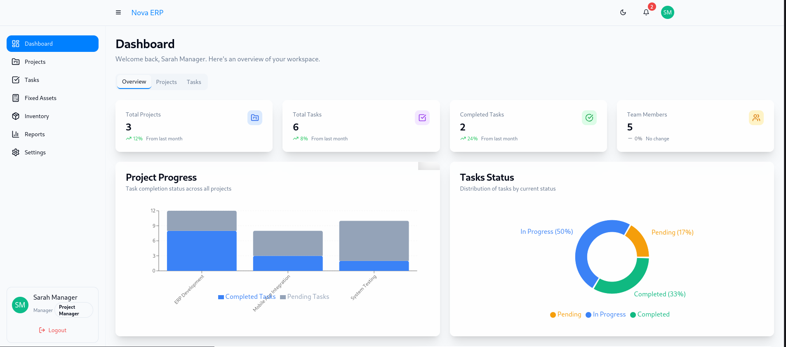
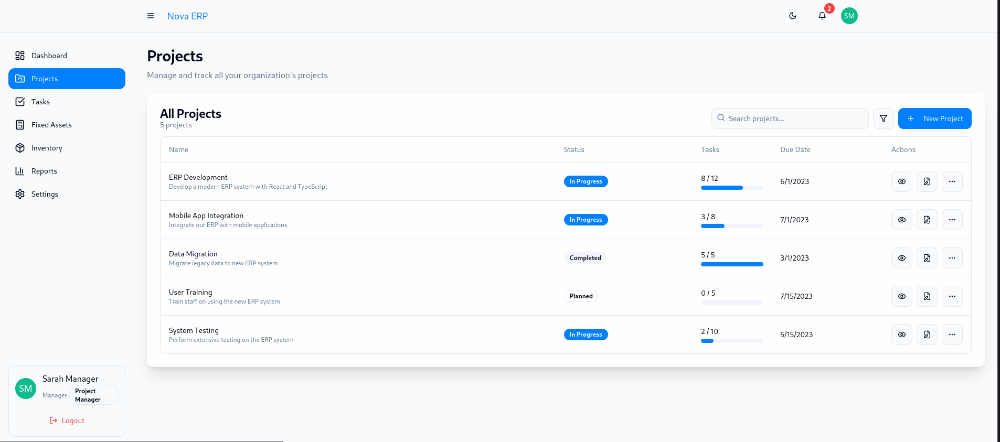
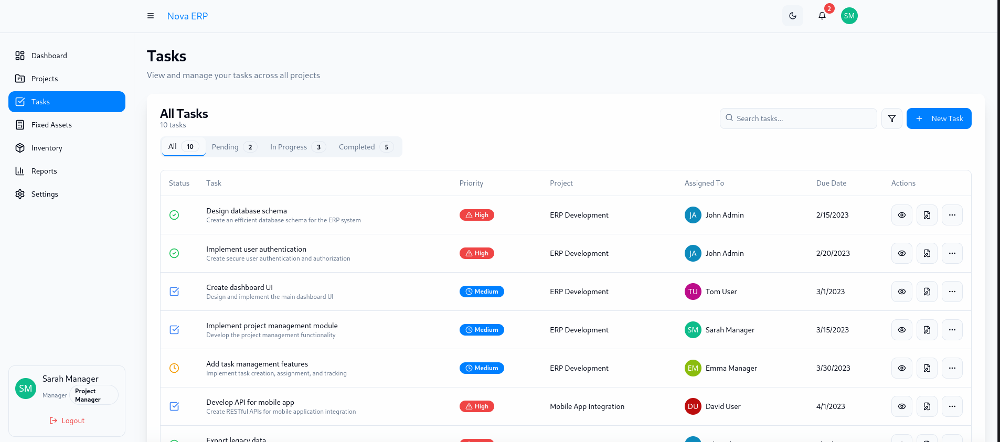
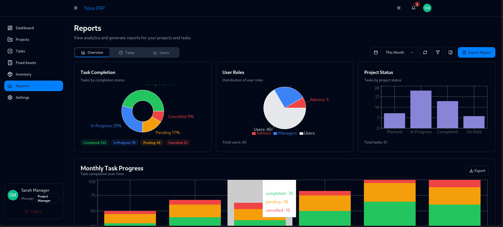

# 🚀 Project Management System

A robust, full-stack project management solution built with a **React frontend** and **Node.js backend**, leveraging **TypeScript** and cutting-edge web technologies. This portfolio project showcases my expertise in system design, scalable architecture, and modern DevOps practices.

---

## 📑 Table of Contents

- [Overview](#-overview)
- [Features](#-features)
- [Screenshots](#-screenshots)
- [Tech Stack & System Design](#-tech-stack--system-design)
- [Prerequisites](#️-prerequisites)
- [Getting Started](#-getting-started)
  - [Docker Setup (Recommended)](#-docker-setup-recommended)
  - [Manual Setup](#-manual-setup)
- [Service Endpoints](#-service-endpoints)
- [Services Overview](#-services-overview)
- [Monitoring](#-monitoring)
- [Project Structure](#-project-structure)
- [Testing](#-testing)
- [API Documentation](#-api-documentation)
- [Dark Mode](#-dark-mode)
- [Error Handling](#️-error-handling)
- [Available Scripts](#-available-scripts)
- [Contributing](#-contributing)
- [License](#-license)

---

## 📖 Overview

This project management system is engineered to optimize task and project workflows with a focus on scalability, performance, and an exceptional user experience. It reflects my ability to design and implement production-ready software solutions.

### 🌟 Key Highlights
- **Scalable Architecture**: Modular microservices design with event-driven patterns.
- **Modern Tech Stack**: Built with TypeScript, React, Node.js, and PostgreSQL.
- **DevOps Excellence**: CI/CD with GitHub Actions, Dockerized deployment, and monitoring via Prometheus/Grafana.
- **User-Centric Design**: Responsive UI with dark/light mode and real-time dashboards.

---

## ✨ Features

- **Interactive Dashboards**: Real-time insights for project tracking and decision-making.
- **Advanced Search & Filtering**: Quickly locate projects, tasks, and resources.
- **Secure Authentication**: Role-based access control with JWT and session management.
- **Theme Support**: Seamless dark/light mode with automatic OS detection.
- **Task Management**: Create, assign, and track tasks with ease.

---


## 🌙 Dark Mode

- **Auto-Detection**: Adapts to OS preferences.
- **Manual Toggle**: Switch via UI.
- **Optimized UI**: High-contrast, accessible design.

---

## 📸 Screenshots

Visuals of:
1. Dashboard


2. Project Management


3. Task Tracking


4. Dark Mode UI


---


## 🛠 Tech Stack & System Design

### Core Architecture
- **Microservices**: Independent, loosely coupled services for flexibility and scalability.
- **Event-Driven**: Asynchronous workflows using Redis for efficient processing.
- **Type Safety**: End-to-end TypeScript for reliability and maintainability.

### Frontend
- **React + Vite**: Lightning-fast development and optimized builds.
- **Tailwind CSS**: Streamlined, utility-first styling.
- **React Query & Axios**: Robust state management and API integration.

### Backend
- **Node.js + Express**: High-performance RESTful API.
- **TypeORM + PostgreSQL**: Structured, relational data management.
- **Redis**: In-memory data store for caching and session management
- **Jest**: Comprehensive testing framework
- **Swagger**: API documentation and testing

### Infrastructure & DevOps
- **NGINX**: Reverse proxy, caching, rate limiting, and load balancing
- **Docker**: Containerization for consistent environments
- **Docker Compose**: Multi-container application management
- **GitHub Actions**: CI/CD pipeline for automated testing and deployment
- **Prometheus**: System and application monitoring
- **Grafana**: Visualization and alerting

### CI/CD Pipeline
- **Automated Testing**: Unit, integration, and end-to-end tests
- **Code Quality Checks**: ESLint and Prettier enforcement
- **Docker Image Building**: Automated container creation
- **Deployment Automation**: Staging and production environments
- **Rollback Mechanism**: Safe deployment strategies

---

## ⚙️ Prerequisites

To run this project locally, ensure you have:
- **Node.js** (v16+)
- **PostgreSQL**
- **Redis**
- **Docker** (recommended for containerized setup)

---

## 🚀 Getting Started

### 🐳 Docker Setup (Recommended)
The easiest way to run the system with all dependencies pre-configured.

1. **Clone the Repository**:
   ```bash
   git clone https://github.com/petro-joseph/project-management-system.git
   cd project-management-system
   ```

2. **Configure Environment**:
   ```bash
   cp backend/.env.example backend/.env
   ```

3. **Launch Services**:
   ```bash
   docker-compose up -d
   ```
   The backend container will automatically run database migrations on startup.

4. **Access the System**:
   - Frontend: [http://localhost:3000](http://localhost:3000)
   - API: [http://localhost:3001](http://localhost:3001)
   - Swagger Docs: [http://localhost:3001/api/docs](http://localhost:3001/api/docs)

5. **View Logs** (optional):
   ```bash
   docker-compose logs -f
   ```

### 💻 Manual Setup
For a hands-on approach without Docker.

1. **Clone the Repository**:
   ```bash
   git clone https://github.com/petro-joseph/project-management-system.git
   cd project-management-system
   ```

2. **Install Dependencies**:
   ```bash
   npm install
   ```

3. **Set Up Environment**:
   ```bash
   cp backend/.env.example backend/.env
   ```

4. **Create Database**:
   ```bash
   psql -U postgres -c "CREATE DATABASE project_management;"
   ```

5. **Run Migrations**:
   ```bash
   npm run migration:run
   ```
   This command will create or update all database tables based on the latest migrations.

6. **Start the Application**:
   ```bash
   npm run dev  # Development mode
   # OR
   npm run build && npm start  # Production mode
   ```

### ℹ️ Frontend Development Server Details

When running the frontend locally with `npm run dev` (inside the `frontend` directory), the Vite development server starts and serves the React app with hot module replacement.

- **Local URL:** [http://localhost:3000](http://localhost:3000) — open this on your development machine.
- **Network URLs:** e.g., `http://192.168.x.x:3000` or `http://172.x.x.x:3000` — these allow other devices on your local network (phone, tablet, other PCs) to access the app.

**What do these network IPs mean?**

They correspond to your computer's private IP addresses on different network interfaces (Wi-Fi, Ethernet, Docker, VPN, etc.). They are only accessible within your local network.

**Customizing port and host:**

- Default port is **3000** .
- You can change this in `frontend/vite.config.ts`, `.env` files, or by CLI flags:

```bash
npm run dev -- --port=3000 --host=0.0.0.0
```

Setting `host` to `0.0.0.0` exposes the server on all network interfaces, enabling access from other devices.

---

## 🌐 Service Endpoints

| Service                | URL                                | Credentials (if applicable)       |
|------------------------|------------------------------------|-----------------------------------|
| Frontend              | [http://localhost:3000](http://localhost:3000) | -                                 |
| Backend API           | [http://localhost:3001](http://localhost:3001) | -                                 |
| Swagger Docs          | [http://localhost:3001/api/docs](http://localhost:3001/api/docs) | -                                 |
| PostgreSQL            | `localhost:5433`                  | User: `postgres`, Pass: `postgres` |
| Mailhog (Email)       | [http://localhost:8025](http://localhost:8025) | -                                 |
| Adminer (DB GUI)      | [http://localhost:8081](http://localhost:8081) | -                                 |
| NGINX Proxy           | [http://localhost:8080](http://localhost:8080) | -                                 |
| Grafana               | [http://localhost/grafana](http://localhost/grafana) | User: `admin`, Pass: `admin`      |
| Prometheus            | [http://localhost/prometheus](http://localhost/prometheus) | -                                 |

---

## 🗂 Services Overview

This section details the services powering the system, their roles, configurations, and interdependencies.

### NGINX Proxy
- **Role**: Reverse proxy and load balancer
- **Ports**:
  - HTTP: `8085`
  - HTTPS: `8443`
- **Volumes**:
  - Configuration: `./nginx/nginx.conf`
  - Logs: `/var/log/nginx`
- **Dependencies**: `backend`, `frontend`, `grafana`, `prometheus`
- **Environment**: `COMPOSE_ENV=development`
- **Command**: Generates SSL certificates on startup

### Backend Service
- **Role**: Main application backend
- **Ports**: Dynamic mapping
- **Environment Variables**:
  - `NODE_ENV=development`
  - Database: `DB_HOST`, `DB_PORT`, etc.
  - `JWT_SECRET`
  - SMTP settings
  - Redis connection details
- **Volumes**:
  - Local directory mounted to container
  - Shared `node_modules`
- **Dependencies**: `postgres`, `mailhog`

### Frontend Service
- **Role**: Client-side application
- **Ports**: Dynamic mapping
- **Environment**: `NODE_ENV=development`
- **Volumes**:
  - Local directory mounted to container
  - Shared `node_modules`
- **Dependencies**: `backend`

### Grafana
- **Role**: Monitoring dashboard
- **Ports**: Dynamic mapping
- **Volumes**:
  - Configuration files
  - Dashboards directory
- **Environment**:
  - `GF_SECURITY_ADMIN_PASSWORD=admin`
  - `GF_SERVER_ROOT_URL=http://localhost/grafana`
- **Dependencies**: `prometheus`

### Prometheus
- **Role**: Monitoring and alerting toolkit
- **Ports**: Dynamic mapping
- **Volumes**: Configuration file
- **Networks**: `app-network`

### Node Exporter
- **Role**: Exposes system metrics for monitoring
- **Ports**: Dynamic mapping
- **Networks**: `app-network`

### Postgres Database
- **Role**: PostgreSQL database
- **Environment**:
  - `POSTGRES_USER=postgres`
  - `POSTGRES_PASSWORD=postgres`
  - `POSTGRES_DB=project_management`
- **Ports**: Dynamic mapping
- **Volumes**: `postgres_data` for persistence
- **Networks**: `app-network`

### Mailhog
- **Role**: SMTP server for development
- **Ports**:
  - SMTP: `1025`
  - Web UI: `8025`
- **Networks**: `app-network`

### Adminer
- **Role**: Database management tool
- **Ports**: Dynamic mapping
- **Environment**: `ADMINER_DEFAULT_SERVER=postgres`
- **Dependencies**: `postgres`
- **Networks**: `app-network`

### Redis
- **Role**: In-memory database for caching
- **Ports**: Dynamic mapping
- **Volumes**: `redis_data` for persistence
- **Networks**: `app-network`

### Redis Exporter
- **Role**: Exposes Redis metrics for monitoring
- **Ports**: Dynamic mapping
- **Environment**: `REDIS_ADDR=redis:6379`
- **Networks**: `app-network`

### Networking
- All services connect via a bridge network (`app-network`), enabling communication using service names as hostnames.

### Volumes
- Persistent storage:
  - Postgres: `postgres_data`
  - Redis: `redis_data`

### Security
- **SSL**: Managed by NGINX with self-generated certificates
- **Grafana**: Secured with `admin` password
- **Database**: Credentials stored in environment variables

---

## 📊 Monitoring

Monitor system health with integrated tools:
- **Grafana**: [http://localhost/grafana](http://localhost/grafana) (User: `admin`, Pass: `admin`)
- **Prometheus**: [http://localhost/prometheus](http://localhost/prometheus)

### Features
- **System Monitoring**: CPU, memory, disk, and network metrics
- **Application Performance**: Response times, error rates, and throughput
- **Custom Dashboards**: Pre-configured dashboards for system and application monitoring
- **Alerting**: Configurable alerts for critical metrics

For detailed documentation on using the monitoring features, see the [Grafana README](grafana/README.md).

Start monitoring:
```bash
docker-compose up -d
```

---

## 📂 Project Structure

### Backend
- `config/` - Database, Redis, and Swagger configurations
- `controllers/` - API endpoint logic
- `dtos/` - Data validation schemas
- `entities/` - Database models (TypeORM)
- `middleware/` - Authentication and error handling
- `migrations/` - Database schema updates
- `routes/` - API route definitions
- `services/` - Business logic
- `tests/` - Unit, integration, and E2E tests

### Frontend
- `components/` - Reusable UI building blocks
- `context/` - Global state management
- `hooks/` - Custom React hooks
- `lib/` - Utilities and helpers
- `pages/` - Application routes
- `styles/` - CSS and Tailwind configurations

---

## ✅ Testing

Run comprehensive tests to ensure quality:
```bash
npm test                  # All tests
npm run test:unit         # Unit tests
npm run test:integration  # Integration tests
npm run test:e2e          # End-to-end tests
npm run test:coverage     # Test coverage report
```

---

## 📑 API Documentation

- **Swagger UI**: [http://localhost:3001/api/docs](http://localhost:3001/api/docs)
- **Postman Collection**: Download [here](./backend/postmanCollection.json) for pre-built requests and examples.

---


## ⚠️ Error Handling

Standardized API responses:
- **Success** (200/201):
  ```json
  { "status": "success", "data": { ... } }
  ```
- **Error** (400/401/404/500):
  ```json
  { "status": "error", "message": "Detailed error" }
  ```

---

## 📜 Available Scripts

```bash
npm run dev           # Start dev server
npm run build         # Build for production
npm start             # Run production build
npm test              # Execute tests
npm run migration:run # Apply database migrations
```

---

## 🤝 Contributing

1. Fork the repo
2. Create a branch: `git checkout -b feature/cool-feature`
3. Commit changes: `git commit -m "Add cool feature"`
4. Push: `git push origin feature/cool-feature`
5. Submit a Pull Request

---

## 📜 License

MIT License - © 2025 Petro Joseph Gati

---

<p align="center">
  Crafted with ❤️ by <a href="https://github.com/petro-joseph">Petro Joseph Gati</a>
</p>

---